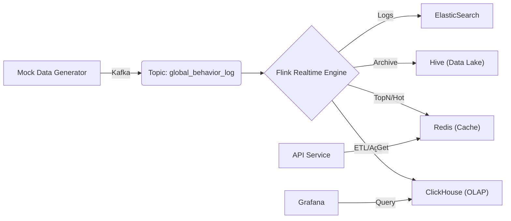

# GlobalInsight 🌍🚀

[](https://github.com/yourusername/GlobalInsight/actions)
[](LICENSE)
[](https://flink.apache.org/)
[](https://www.java.com/)
[](https://kubernetes.io/)

**GlobalInsight** 是一款专为跨境电商场景设计的高并发实时数据智能处理平台。该项目集成了海量数据接入、分布式实时计算、全文检索以及多维监控预警等核心能力，旨在提供从底层数据清洗到上层业务可视化的一站式解决方案。

---

## 📖 目录 (Table of Contents)

- [核心功能 (Features)](#-核心功能-features)
- [系统架构 (Architecture)](#-系统架构-architecture)
- [技术栈 (Tech Stack)](#-技术栈-tech-stack)
- [从零开始 (Getting Started)](#-从零开始-getting-started)
  - [环境依赖 (Prerequisites)](#环境依赖-prerequisites)
  - [快速部署 (Quick Deployment)](#快速部署-quick-deployment)
- [项目结构 (Project Structure)](#-项目结构-project-structure)
- [使用指南 (Usage Guide)](#-使用指南-usage-guide)
- [贡献指南 (Contributing)](#-贡献指南-contributing)
- [许可证 (License)](#-许可证-license)

---

## 🚀 核心功能 (Features)

GlobalInsight 解决跨境电商场景下的海量数据实时处理痛点：

*   **📊 实时用户画像与推荐**：基于用户行为流（点击、浏览、加购），构建动态用户画像并实现毫秒级商品推荐分发。
*   **🔍 高性能全文检索**：构建商品多语言倒排索引，支持高并发下的复杂查询与分词处理。
*   **⚡ 流式数据处理**：利用 **Apache Flink** 处理实时流量，实现异常数据清洗（ETL）与多维度业务指标计算（如实时 GMV）。
*   **🔥 实时热榜 (TopN)**：基于滑动窗口算法，计算全站商品热搜榜单与实时销量排行。
*   **📈 可观测性监控大盘**：集成 **Prometheus** 与 **Grafana**，提供数据积压报警、作业健康度监控及业务流量实时看板。
*   **☁️ 云原生自动化部署**：全套组件支持 **Kubernetes** 容器化编排，具备高可用与弹性扩展能力（支持 TKE）。

---

## 🏗 系统架构 (Architecture)

GlobalInsight 采用现代化的 **Lambda 架构** 变体，通过存算分离设计解决 "海量写入"与"复杂分析" 的冲突。

### 数据流转图


### 存储分层策略
详见 [架构设计文档](log/architecture_design_reference.md)。

| 层级 | 组件 | 用途 |
| :--- | :--- | :--- |
| **接入层** | Kafka | 高吞吐消息缓冲，削峰填谷 |
| **计算层** | Flink | 流批一体计算，实时指标生成 |
| **服务层** | Redis | 亚毫秒级热点数据查询 (Hot Data) |
| **分析层** | ClickHouse | 秒级 OLAP 多维分析 (Warm Data) |
| **归档层** | Hive (HDFS) | 全量历史数据存储 (Cold Data) |

---

## 🛠 技术栈 (Tech Stack)

*   **核心后端**: Java 8+, Maven
*   **实时计算**: Apache Flink 1.17.1
*   **消息队列**: Apache Kafka 3.4
*   **存储引擎**:
    *   ClickHouse (OLAP)
    *   Redis (Cache)
    *   ElasticSearch (Search/Log)
    *   Hive / HDFS (Data Warehouse)
*   **监控运维**: Prometheus, Grafana
*   **基础设施**: Docker, Kubernetes (K8s), Tencent Kubernetes Engine (TKE)

---

## 🏁 从零开始 (Getting Started)

### 环境依赖 (Prerequisites)

*   **Java**: JDK 8 或 11
*   **Maven**: 3.6+
*   **Docker**: 20.10+ (及其 Docker Compose)
*   *(可选)* **Kubernetes Cluster**: 用于生产环境部署

### 快速部署 (Quick Deployment)

#### 1. 克隆项目
```bash
git clone https://github.com/yourusername/GlobalInsight.git
cd GlobalInsight
```

#### 2. 编译构建
使用 Maven 构建核心 Jar 包：
```bash
cd Code
mvn clean package -DskipTests
# 构建产物位于 target/GlobalInsight-1.0.jar
```

#### 3. 本地环境启动 (Docker Compose)
为了快速体验，可以使用 Docker Compose 启动基础依赖环境（Kafka, Zookeeper, Redis 等）：
```bash
cd ../GlobalInsight-Env
docker-compose up -d
```

#### 4. 提交 Flink 作业
确保 Flink 集群已启动，然后提交作业：
```bash
# 提交实时 GMV 计算作业
./bin/flink run -c org.example.RealtimeGMVApp target/GlobalInsight-1.0.jar

# 提交热搜排行作业
./bin/flink run -c org.example.HotSearchRankingApp target/GlobalInsight-1.0.jar
```

---

## 📂 项目结构 (Project Structure)

```
GlobalInsight/
├── Code/                   # 核心源代码 (Java/Flink)
│   ├── src/main/java/      # Flink 作业实现 (Sink, Source, ProcessFunction)
│   ├── pom.xml             # Maven 依赖配置
│   └── Dockerfile          # 应用镜像构建文件
├── GlobalInsight-Env/      # 本地开发环境配置
│   ├── docker-compose.yml  # 中间件快速启动
│   └── clickhouse-init.sql # 数据库初始化脚本
├── k8s-deploy/             # Kubernetes 部署清单
│   ├── 00-base.yaml        # 基础资源配置
│   ├── 04-flink-session.yaml # Flink Session 集群
│   └── ...                 # 其他组件配置
├── log/                    # 详细设计文档与架构图
└── prometheus/             # 监控配置文件
```

---

## 💡 使用指南 (Usage Guide)

### 1. 模拟数据生成
项目内置了一个高性能数据生成器，用于压测和演示：
```bash
# 运行数据生成器 (直接输出到 Kafka)
java -cp target/GlobalInsight-1.0.jar org.example.MockDataGenerator
```

### 2. 查看实时大屏
部署 Grafana 后（默认端口 3000），导入 `prometheus/dashboard.json` (如有) 即可查看：
- **实时 GMV 曲线**
- **当前在线用户数**
- **热门商品 Top 10**

### 3. Kubernetes 部署
详见 [TKE 部署指南](k8s-deploy/TKE-MINIMAL-GUIDE.md)。可使用提供的 PowerShell 脚本一键部署：
```powershell
cd k8s-deploy
.\local-deploy-to-tke.ps1
```

---

## 🤝 贡献指南 (Contributing)

欢迎提交 Issue 和 Pull Request！
1. Fork 本项目
2. 创建特性分支 (`git checkout -b feature/AmazingFeature`)
3. 提交更改 (`git commit -m 'Add some AmazingFeature'`)
4. 推送到分支 (`git push origin feature/AmazingFeature`)
5. 提交 Pull Request

---

## 📜 许可证 (License)

本项目基于 Apache-2.0 协议开源 - 详见 [LICENSE](LICENSE) 文件。

